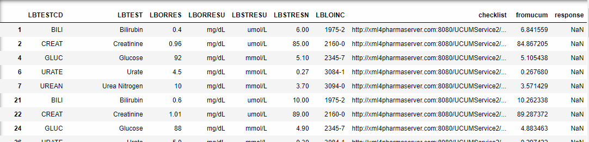

# pyucum
Sam Tomioka

**pyucum** can be used to generate UCUM units from `LBORRESU` and `LBSTRESU`, verify UCUM units, and convert results in `LBORRESU` to results in `LBSTRESU` using UCUM API. It is updated to work with given **LOINC value** to identify proper molecular weight used in the result conversion on molar based units. This tool works well with **CDISC SDTM.LB** and **ADaM.ADLB**.

## 1. Background
The verification of scientific units and conversion from the reported units to standard units have been always challenging for Data Science due to several reasons:

1. Need a lookup table that consists of all possible input and output units for measurements, name of the measurements (e.g. Glucose, Weight, ...), conversion factors, molar weights etc.
2. The names of the measurement in the lookup table and incoming data must match
3. The incoming units must be in the lookup table
4. Maintenance of the lookup table must be synched with standard terminology update
5. Require careful medical review in addition to laborsome Data Science review
and more...

Despite the challenges, the lookup table approach is the norm for many companies for verification of the units and conversion. Consideration was given for more systematic approach that does not require to use the lab test names[1], but some units rely on molar weight and/or valence of ion of the specific lab tests, so this approach does not solve the problem. The regulatory agencies require the sponsor to use standardized units for reporting and analysis[2]. The PMDA requires SI units for all reporting and analysis[3,4]. The differences in requirement force us to maintain region specific conversion for some measurements which add additional complexity.

The approach Jozef Aerts discussed uses RestAPI available through [Unified Code for Units of Measure (UCUM) Resources](https://ucum.nlm.nih.gov/ucum-lhc/index.html) which is maintained by the US National Library of Medicine (NLM)[5]. The benefit is obvious that we can potentially eliminate the maintenance of the lab conversion lookup table. Here is what they say about themselves.

>The Unified Code for Units of Measure (UCUM) is a code system intended to include all units of measures being contemporarily used in international science, engineering, and business. The purpose is to facilitate unambiguous electronic communication of quantities together with their units. The focus is on electronic communication, as opposed to communication between humans. A typical application of The Unified Code for Units of Measure are electronic data interchange (EDI) protocols, but there is nothing that prevents it from being used in other types of machine communication.

The UCUM is the ISO 11240 compliant standard and has been used in ICSR E2B submissions for regulators adopted ICH E2B(R3). [FDA requires the UCUM codes](https://www.fda.gov/industry/fda-resources-data-standards/units-measurement) for the [eVAERS ICSR E2B (R3) submissions](https://www.fda.gov/media/98617/download), [dosage strength in both content of product labeling](https://www.fda.gov/industry/fda-resources-data-standards/structured-product-labeling-resources) and [Drug Establishment Registration and Drug Listing](https://www.fda.gov/regulatory-information/search-fda-guidance-documents/providing-regulatory-submissions-electronic-format-drug-establishment-registration-and-drug-listing). UCUM codes have been adopted by HL7 [FHIR](https://www.hl7.org/fhir/terminologies-systems.html).

## 2. Installation

To install,
```
pip install pyucum
```
Following packages are required

<<<<<<< HEAD
'numpy','pandas','tqdm ','urllib','seaborn ','sklearn','matplotlib', 'bokeh'
=======
'numpy','pandas','tqdm ','urllib','seaborn ','sklearn','matplotlib'
>>>>>>> gh-pages


## 3. Some useful utilities

### 3.1.  Apply regular expression to LBORRESU and LBSTRESU
`orresu2ucum(df_,patterns)`
This will take datafram containing `LBORRESU` and `LBSTRESU`, and regular expression you want to pass to make UCUM units. It returns the dataframe with converted units, and the list of converted units.

Although CDISC released a downloadable [CDISC UNIT and UCUM mapping xlsx file](https://www.cdisc.org/standards/terminology), this tool will not use it since CDISC UNIT does not cover all reported units used by the clinical laboratory/bioanalytical/PK vendors. Regular expression along with UCUM unit validity service was used to convert and verify the units provided by the lab vendors before using conversion RestAPI.

Example:
```python
from pyucum import *

patterns = [("%","%25"),
           ("\A[xX]?10[^E]", "10*"),
           ("IU", "%5BIU%5D"),
           ("\Anan", ""),
           ("\ANONE", ""),
           ("\A[rR][Aa][Tt][Ii][Oo]", ""),
           ("\ApH", ""),
           ("Eq[l]?","eq"),
           ("\ATI/L","TR/L"),#update T to TR
           ("\AGI/L","GA/L"),#update G to GA
           ("V/V","L/L"),
           ("[a-z]{0,4}/HPF","/%5BHPF%5D"),
           ("[a-z]{0,4}/LPF","/%5BLPF%5D"),
           ("fraction of 1","1"),
            ("sec","s"),
            ("1.73m2","%7B1.73_m2%7D"),
            ("\AG/L","GA/L")
           ]

dfconverted, ucumlist=orresu2ucum(df1,patterns)
```

### 3.2. Verify units using UCUM service

`ucumVerify(ucumlist,url)`

- `ucumlist` is the list of UCUM units (not CDISC SDTM CT UNIT!) to be verified
- `url` is for API services.

  - Currently, https://ucum.nlm.nih.gov/ucum-service/v1/ from [Unified Code for Units of Measure (UCUM) Resources](https://ucum.nlm.nih.gov/ucum-lhc/index.html)  does not provide LOINC based result conversion services.
  - If LOINC based conversion is required, use http://xml4pharmaserver.com:8080/UCUMService2/rest from [xml4pharma](http://www.xml4pharma.com/UCUM/Instructions_for_testing_the_RESTful_web_service_for_molar_mass_unit_conversions.pdf)


Example:
```python
from pyucum import *

url='http://xml4pharmaserver.com:8080/UCUMService2/rest'
#url=https://ucum.nlm.nih.gov/ucum-service/v1/
ucumVerify(ucumlist, url)
```
Output:
```output
['g/dL = true',
 'mg/dL = true',
 'ng/mL = true',
 '10*3/uL = true',
 '%25 = true',
 '10*6/uL = true',
 '10*3/mm3 = true',
 'meq/L = true',
 'mL/min = true',
 'ng/L = true',
 'ng/dL = true',
 'u%5BIU%5D/mL = true',
```

### 3.3. Convert results in LBORRESU to results in LBSTRESU

`convert_unit()`

Example:
```python
from pyucum import *

findings,full,response=convert_unit(nodupdf, url, patterns,loinconly=0)

findings[(findings['fromucum'].notnull())]
```
Output:


To see other utilities, please go to examples from [here](https://stomioka.github.io/ucum/docs/ucum_20190526-test-large-sample.html)


## 3. Verification of UCUM and XML4Pharma API services


1. **The initial evaluation** (2019-02-20) was done on RestAPI available through [Unified Code for Units of Measure (UCUM) Resources](https://ucum.nlm.nih.gov/ucum-lhc/index.html) and the findings are summarized [here](https://stomioka.github.io/ucum/docs/usum_201902.html).
2. **The second evaluation** (2019-05-05) was completed on the test version of RestAPI provided by Jozef Aerts at [xml4pharma](http://www.xml4pharma.com/). The findings are summarized [here](https://stomioka.github.io/ucum/docs/ucum_201905-test-large-sample.html).

3. **The third evaluation**  (2019-05-25) was completed on the updated test version of RestAPI provided by Jozef Aerts at [xml4pharma](http://www.xml4pharma.com/). Several improvements were implemented by [Jozef Aerts](http://www.xml4pharma.com/UCUM/Instructions_for_testing_the_RESTful_web_service_for_molar_mass_unit_conversions.pdf)  since the second evaluation was completed.
    - It accounts for the molecular weights of the analyte into the conversion between molar and mass concentrations to facilitate the conversion of the lab results, verification of the standardized lab results and LOINC code provided by the vendors.
    - The return message contains the MW that was used for the conversion.

    

    - Previously, there was one kind of error message related to LOINC. For example,
      >Error message "ERROR: No MW value for the LOINC code xxx-x is available or the LOINC code is invalid"

      The updated service returns LOINC related error message either
        1. Invalid LOINC code XXXX
        2. No MW found for LOINC Part Number LPxxxx for LOINC code yyyy<br>
          This updates allow us to investigate issues without browsing LOINC.

    - The list of MW for the LOINC-component-part  was extended.

  The findings from the third evaluation are summarized [here](https://stomioka.github.io/ucum/docs/ucum_20190526-test-large-sample.html).
